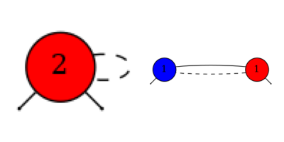
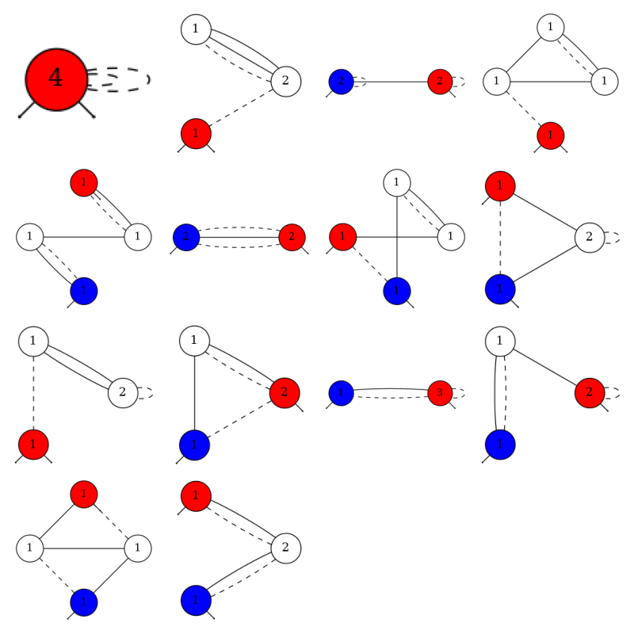

# Feynman Diagram Generator

- This project is a simple Feynman diagram generator written in C++ using the Boost Graph Library.
- **At the moment, only undirected diagrams corresponding to the one-electron self-energy with electron-phonon interactions can be output.**





## Prerequisites

Ensure you have the following installed on your system:
- CMake (version 3.13 or higher)
- A C++ compiler (e.g., g++, clang)
- Boost library
- Graphviz (for generating graphical output)

### Install dependencies
#### Debian-based systems:
```bash
sudo apt update
sudo apt install cmake g++ libboost-all-dev graphviz
```

#### Arch Linux:
```bash
sudo pacman -S cmake boost graphviz
```

#### macOS (with Homebrew):
```bash
brew install cmake boost graphviz
```

## Usage

1. Clone the repository:
```bash
git clone git@github.com:cohsh/feynman-diagram-generator.git
cd feynman-diagram-generator
```

2. Create a build directory and run CMake:
```bash
cmake -S . -B build
```

3. Build the project:
```bash
make
```

4. Run the executable ($n=1,2$ is the order of diagrams):
```bash
./generate_graph.sh n
```
This will generate `dot/graph_*.dot` and `png/graph_*.png` files.