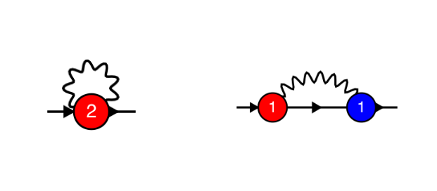
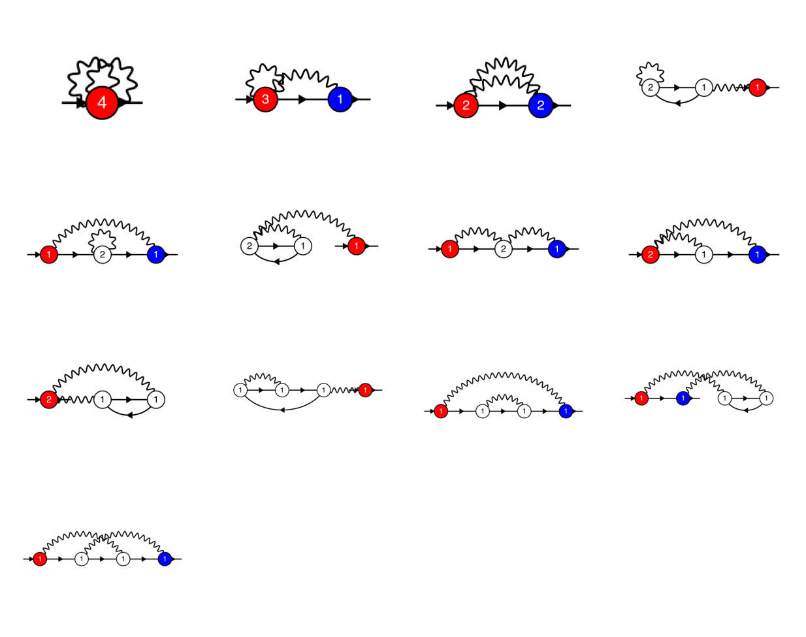
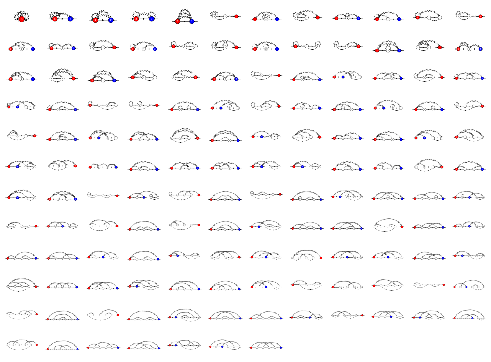

# Feynman Diagram Generator

- This project is a simple Feynman diagram generator written in C++ using the Boost Graph Library.
- **At the moment, only undirected diagrams corresponding to the one-electron self-energy with electron-phonon interactions can be output.**
- Diagrams are enumerated up to isomorphism and, by default, restricted to the
  **proper (one-particle-irreducible)** ones. They are drawn by a built-in SVG
  renderer (electron line as a horizontal backbone, phonon lines as wavy arcs),
  so Graphviz is optional.

Order 1 (proper):



Order 2 (proper):



Order 3 (proper, 139 diagrams):



## Prerequisites

Ensure you have the following installed on your system:
- CMake (version 3.13 or higher)
- A C++ compiler (e.g., g++, clang)
- Boost library
- Graphviz (optional; only needed to rasterize the `.dot` files to PNG — SVG
  output works without it)

### Install dependencies
#### Debian-based systems:
```bash
sudo apt update
sudo apt install cmake g++ libboost-all-dev graphviz
```

#### Arch Linux:
```bash
sudo pacman -S cmake boost graphviz
```

#### macOS (with Homebrew):
```bash
brew install cmake boost graphviz
```

## Usage

1. Clone the repository:
```bash
git clone git@github.com:cohsh/feynman-diagram-generator.git
cd feynman-diagram-generator
```

2. Create a build directory and run CMake:
```bash
cmake -S . -B build
```

3. Build the project:
```bash
make
```

4. Run the executable ($n=1,2,3$ is the order of diagrams):
```bash
./generate_graph.sh n
```
This generates:
- `svg/graph_*.svg` — diagrams drawn directly by a built-in renderer
  (electron lines as a horizontal backbone, phonon lines as wavy arcs), so
  Graphviz is **not** required for vector output;
- `dot/graph_*.dot` — Graphviz source;
- `png/graph_*.png` — rasterized from the dot files, only if Graphviz `dot` is
  installed.

By default only **proper (one-particle-irreducible)** self-energy diagrams are
produced. To also include the improper (reducible) ones, pass `improper`:
```bash
./generate_graph.sh n improper
```